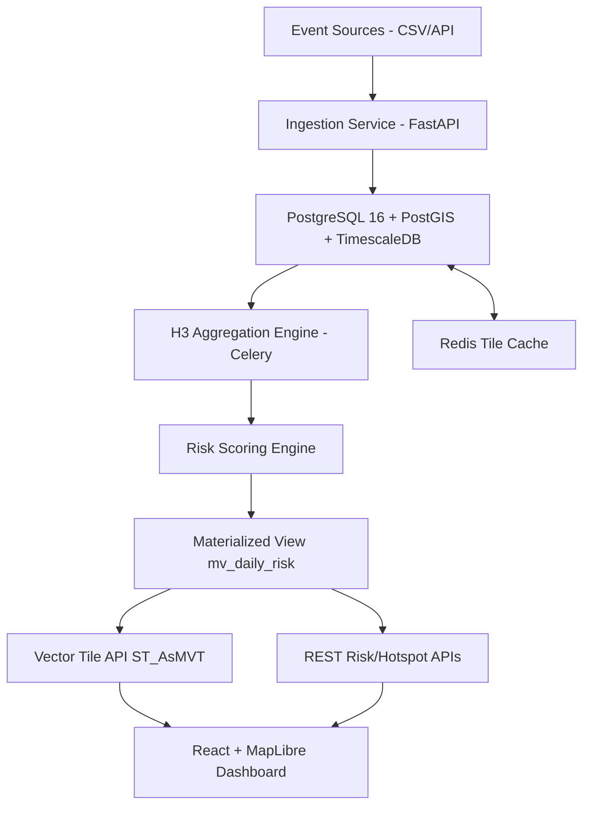

# Spatial-Temporal Risk Intelligence Engine

Production-grade spatial-temporal analytics platform for government, emergency operations, critical infrastructure, and public safety intelligence workflows.

The engine ingests geolocated events over time, aggregates to H3 cells, computes trend-sensitive risk scores, detects anomalies, and serves operational outputs through REST and vector tiles for a temporal geospatial dashboard.

## Problem Context

Traditional incident dashboards frequently fail at:
- combining spatial density with temporal acceleration,
- identifying early-stage risk growth before threshold breaches,
- delivering geospatial outputs in tile-native formats for real-time web operations.

This system addresses those gaps with a time-partitioned PostGIS + Timescale architecture and asynchronous analytics execution.

## Real-World Use Cases

- **Wildfire preparedness:** detect sudden ignition cluster growth and prioritize patrol/resource staging.
- **Urban safety intelligence:** monitor crime activity growth in micro-zones and trigger analyst review.
- **Flood/utility resilience:** identify outage/flood incident surge zones and support dispatch sequencing.
- **Critical asset protection:** maintain risk heatmaps for substations, transport corridors, and treatment plants.

## High-Level Architecture



## Technology Stack

### Backend
- Python 3.11
- FastAPI
- SQLAlchemy 2.x
- Celery + Redis
- PostgreSQL 16 + PostGIS + TimescaleDB
- h3-py, GeoPandas, Shapely
- Alembic migrations

### Frontend
- React (Vite + TypeScript)
- MapLibre GL JS
- Zustand state store

## Database and GIS

### Stack and Extensions

- **PostgreSQL 16** with **PostGIS** (spatial types, indexes, functions) and **TimescaleDB** (hypertables, time-based partitioning).
- Extensions enabled at migration: `CREATE EXTENSION postgis`, `CREATE EXTENSION timescaledb`.
- All geometry stored in **WGS 84** (SRID 4326); tile generation uses **Web Mercator** (SRID 3857) via `ST_Transform`.

### Schema Entities

| Table | Purpose |
|-------|---------|
| `events` | Hypertable partitioned by `event_timestamp` (1-month chunks). Columns: `event_type`, `event_timestamp`, `geom` (Point, 4326), `attributes_json` (JSONB). |
| `h3_cells` | H3 hexagon polygons (`GEOMETRY(Polygon, 4326)`) keyed by `h3_index` and `resolution`. Used for aggregation joins and tile geometry. |
| `cell_aggregates` | Daily event counts, 7-day rolling average, growth rate per H3 cell and date. |
| `risk_scores` | Normalized risk score (0–100) and `risk_level` enum per H3/day. |
| `anomaly_flags` | Z-score anomaly indicator and `flagged` boolean per H3/day. |
| `users` | JWT principals for RBAC (`admin`, `analyst`, `public`). |

### Spatial Indexes (GIST)

- `idx_events_geom_gist` on `events.geom` — point-in-polygon and bbox queries.
- `idx_h3_cells_geom_gist` on `h3_cells.geom` — spatial joins and tile clipping.
- `idx_mv_daily_risk_geom_gist` on `mv_daily_risk.geom` — vector tile `ST_Intersects` filtering.

### GIS Functions in Use

- **Ingestion:** `ST_SetSRID(ST_MakePoint(longitude, latitude), 4326)` for event points.
- **Analytics:** `ST_X(geom)`, `ST_Y(geom)` for coordinate extraction; `ST_GeomFromText(wkt, 4326)` for H3 polygon inserts.
- **Vector tiles:** `ST_TileEnvelope(z,x,y)` for tile bounds; `ST_Transform(geom, 3857)` for Web Mercator; `ST_Intersects` for clipping; `ST_AsMVTGeom` and `ST_AsMVT` for MVT output.

### Operational View

- `mv_daily_risk`: denormalized materialized view joining `risk_scores`, `cell_aggregates`, `h3_cells`, and `anomaly_flags`, including `geom` for tile serving. Refreshed after analytics runs.

## Risk Scoring Logic

Pipeline runs in Celery workers:

1. **H3 Binning**
   - Event points converted to H3 index at configurable resolution (`7` or `8`).
2. **Daily Aggregation**
   - Group by day (`date_trunc('day', event_timestamp)`) and H3 index.
3. **Rolling Mean**
   - 7-day moving average by H3 partition.
4. **Growth Rate**
   - `(current_day - previous_7_day_avg) / previous_7_day_avg`.
5. **Composite Risk**
   - `risk = event_count*0.5 + growth_rate*0.3 + rolling_7d_avg*0.2`.
6. **Normalization**
   - Min-max normalized to `0..100` across run interval.
7. **Risk Classification**
   - `0-25 low`, `26-50 medium`, `51-75 high`, `76-100 critical`.
8. **Anomaly Detection**
   - Z-score on daily count sequence per H3 (`flagged = z >= 2.0`).

## API Surface

- `POST /v1/events/upload` - bulk event ingestion
- `GET /v1/events` - event query with temporal/type filters
- `POST /v1/analytics/run` - enqueue analytics pipeline
- `GET /v1/risk/{date}` - risk outputs for date
- `GET /v1/tiles/{z}/{x}/{y}.mvt` - PostGIS-generated vector tile stream
- `GET /v1/hotspots?start_date=&end_date=` - emerging hotspot feed
- `POST /v1/auth/token` - JWT issuance
- `GET /v1/health/live` and `GET /v1/health/ready`
- `GET /metrics` - Prometheus-compatible metrics endpoint

## Security and Governance

- JWT authentication with signed access tokens.
- Route-level RBAC using `admin`, `analyst`, and `public` roles.
- Rate limiting via `slowapi` at API boundary.
- JSONB attributes for controlled extensibility without schema churn.

## Vector Tile Strategy

Tiles are generated in-database with:
- `ST_TileEnvelope`
- `ST_AsMVTGeom`
- `ST_AsMVT`

Redis caches recent tile payloads for low-latency dashboard refreshes.

## Performance Engineering

Key optimizations implemented:
- Timescale hypertable partitioning on `events.event_timestamp` (1 month chunks).
- Spatial index (`GIST`) on `events.geom` and `h3_cells.geom`.
- Temporal indexes on event and risk buckets.
- H3 and risk-level indexes for hotspot retrieval.
- Materialized view for tile/read path acceleration.
- Cache-first tile response strategy in Redis (5-minute TTL).

Recommended query tuning workflow:
- Run `EXPLAIN (ANALYZE, BUFFERS)` on tile and hotspot SQL.
- Validate index hit rate and heap fetch behavior.
- Adjust `work_mem`, parallel workers, and Timescale chunk interval if workload characteristics shift.

## Deployment

### 1) Start Platform

```bash
docker compose up --build
```

Services:
- Backend API: `http://localhost:8000`
- Frontend dashboard: `http://localhost:5173`
- PostgreSQL: `localhost:5432`
- Redis: `localhost:6379`

### 2) Run Migration

```bash
docker compose exec backend alembic upgrade head
```

### 3) Create Initial Users (recommended)

Use the bootstrap command:

```bash
python -m backend.app.utils.bootstrap_admin --username admin --password "CHANGE_ME" --role admin
python -m backend.app.utils.bootstrap_admin --username analyst --password "CHANGE_ME" --role analyst
```

This command is idempotent: if the user exists, password and role are updated.

### 3b) Seed Events from Real Source Files

Load production-like event feeds from CSV (no hardcoded demo data):

```bash
python -m backend.app.utils.seed_events --csv /path/to/events.csv
```

Expected CSV headers:
- `event_type`
- `event_timestamp` (ISO-8601)
- `longitude`
- `latitude`
- `attributes_json` (optional JSON object as string)

### 4) Run Analytics

Call:
- `POST /v1/analytics/run?resolution=8`

### 5) Open Dashboard

Frontend consumes vector tiles and renders temporal risk layers with:
- date slider,
- playback animation,
- risk-level toggles,
- popup metrics (`event_count`, `growth_rate`, `risk_score`, anomaly flag).

## Integration Testing

Integration tests are in `backend/tests` and cover:
- event ingestion + retrieval,
- analytics job enqueue behavior,
- vector tile binary response path.

Run:

```bash
pytest backend/tests -q
```

Note: tests require PostgreSQL/PostGIS/Timescale and Redis plus applied migrations.

## Performance Profiling Scripts

Operational SQL profiles are under `backend/sql/performance`:
- `explain_tile_query.sql`
- `explain_hotspots_query.sql`
- `README.md` with tuning checklist.

Run:

```bash
psql "$DATABASE_URL" -f backend/sql/performance/explain_tile_query.sql
psql "$DATABASE_URL" -f backend/sql/performance/explain_hotspots_query.sql
```

## CI/CD Quality Gates

GitHub Actions workflow at `.github/workflows/ci.yml` executes:
- backend lint (`ruff`),
- backend typecheck (`mypy`),
- migration smoke test (`upgrade -> downgrade -> upgrade`),
- backend integration tests (`pytest`),
- frontend production build (`npm ci && npm run build`).

## Project Structure

```text
risk-intelligence-engine/
├── backend/
│   ├── app/
│   ├── initdb/
│   ├── tests/
│   ├── requirements.txt
│   └── main.py
├── frontend/
├── alembic/
├── docker-compose.yml
├── Dockerfile
└── README.md
```

## Enterprise-Grade Enhancements (Roadmap)

- Multi-tenant schema isolation and row-level security.
- Event stream ingestion from Kafka/MQTT.
- pgRouting-based network accessibility risk overlays.
- Probabilistic forecasting (Bayesian/STL/Prophet) per H3 corridor.
- Data quality scoring and lineage metadata.
- SSO (OIDC/SAML), audit trail, and policy-based access control.
- Continuous model drift detection and scoring recalibration.


## Production Checklist

- [ ] Set strong JWT_SECRET_KEY
- [ ] Run migrations before first deploy
- [ ] Bootstrap admin and analyst users
- [ ] Configure rate limits for production load
- [ ] Enable HTTPS and secure Redis
